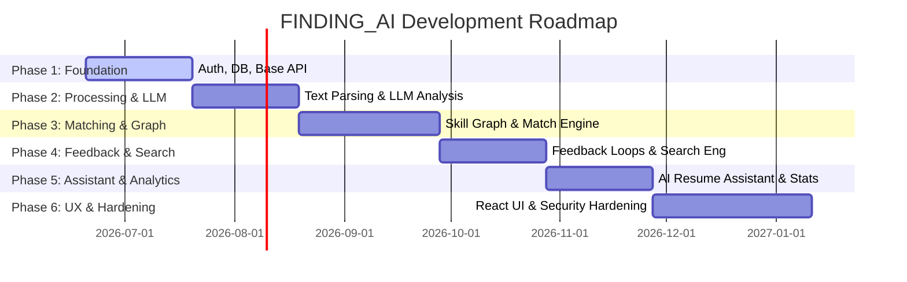

# 🗺️ FINDING_AI Project Roadmap

This roadmap outlines the phases of development for the **FINDING_AI** platform. Contributors can use this timeline to understand the priority of tasks and how the 15 modules fit together.

---

## 📅 Roadmap Overview

---

## 🛠️ Phases of Development

### 📁 Phase 1: Core System Foundation
**Focus**: Establish database architecture, REST API foundations, authorization frameworks, and basic CRUD capabilities.
* **Included Modules**:
  * **Module 1**: User Authentication & Profile Management
  * **Module 6**: Job Posting Management (Basic CRUD)
  * **Module 12**: REST API Base & Versioning Setup
  * **Module 14**: Database Schema Design & Migrations
* **Target Milestones**:
  * [ ] Secure user registration and login workflows using JWT authentication.
  * [ ] PostgreSQL instance setup with relational schemas mapping Users, Profiles, and Jobs.
  * [ ] API endpoints available under `/api/v1/` with full interactive Swagger/OpenAPI documentation.

---

### 🧠 Phase 2: Resume Processing & Local LLM Integration
**Focus**: Implement secure document uploading, parse raw file contents, and configure local LLM extraction.
* **Included Modules**:
  * **Module 2**: Resume Upload & Processing Pipeline
  * **Module 3**: Local LLM (Ollama) Integration & Entity Parsing
  * **Module 4**: Resume Archetype & Delta Storage (Database optimization)
* **Target Milestones**:
  * [ ] Direct upload handlers for PDF, DOCX, and TXT files with format verification.
  * [ ] Seamless Ollama client connection parsing resumes into structured JSON schemas.
  * [ ] Archetype generator clustering profiles and storing candidate records as delta structures.

---

### 🕸️ Phase 3: Semantic Skill Graph & Match Engine
**Focus**: Map relations between skills and write quantitative scoring algorithms.
* **Included Modules**:
  * **Module 5**: Skill Ontology & Embeddings
  * **Module 7**: AI Candidate Matching Engine
* **Target Milestones**:
  * [ ] Relational skill ontology mapping parent-child-sibling relationships.
  * [ ] Vector database (`pgvector`) configured to store and retrieve skill vectors.
  * [ ] Candidate-to-Job matching engine scoring candidates dynamically based on skills, experience recency, and certifications.

---

### 🔄 Phase 4: Search Engine & Feedback Loops
**Focus**: Connect search capabilities with continuous reinforcement learning.
* **Included Modules**:
  * **Module 9**: Employer Feedback Learning System
  * **Module 10**: Semantic Search & Recommendation Engine
* **Target Milestones**:
  * [ ] Vector similarity search allowing recruiters to search profiles by intent.
  * [ ] Applicant review actions in UI feeding back into matching engines.
  * [ ] Weight adjustment routines tuning search rankings according to positive/negative recruitment outcomes.

---

### 📊 Phase 5: Assistant Features & Analytics
**Focus**: Deliver value-add tools for candidates and visualization dashboards for employers.
* **Included Modules**:
  * **Module 8**: AI Resume Improvement Assistant
  * **Module 11**: Analytics Dashboard Backend
* **Target Milestones**:
  * [ ] Missing skill detection prompting candidates with targeted learning suggestions.
  * [ ] Ollama prompts providing rephrasing suggestions for weaker resume sections.
  * [ ] Analytics endpoints providing historical matching statistics and skill demand trends.

---

### 💻 Phase 6: Frontend Integration & Platform Hardening
**Focus**: Connect all APIs to the user interfaces, polish UX, and secure candidate data.
* **Included Modules**:
  * **Module 13**: Responsive React UI Dashboard
  * **Module 15**: Encryption, Compliance (GDPR), and Security Auditing
* **Target Milestones**:
  * [ ] Fully responsive React dashboards for Job Seekers and Employers.
  * [ ] Interactive charts (Recharts) visualizing analytics in the frontend.
  * [ ] PII encryption-at-rest and strict CORS and rate limiting controls.
  * [ ] Compliance actions (Account Deletion / Data Archive) operational.
