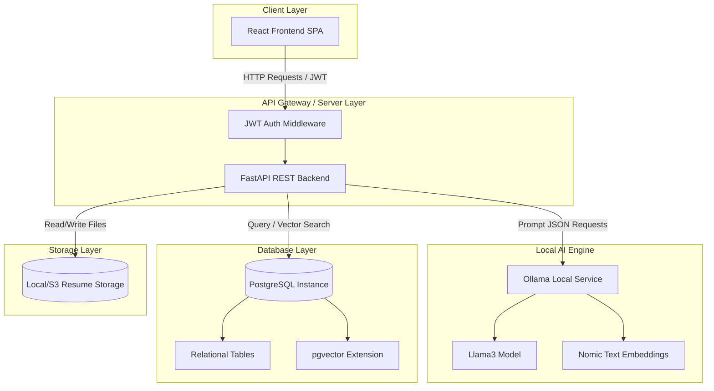
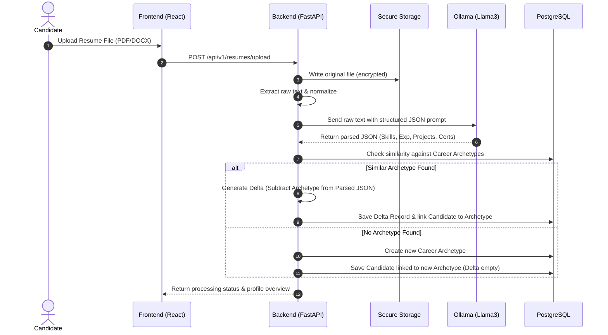
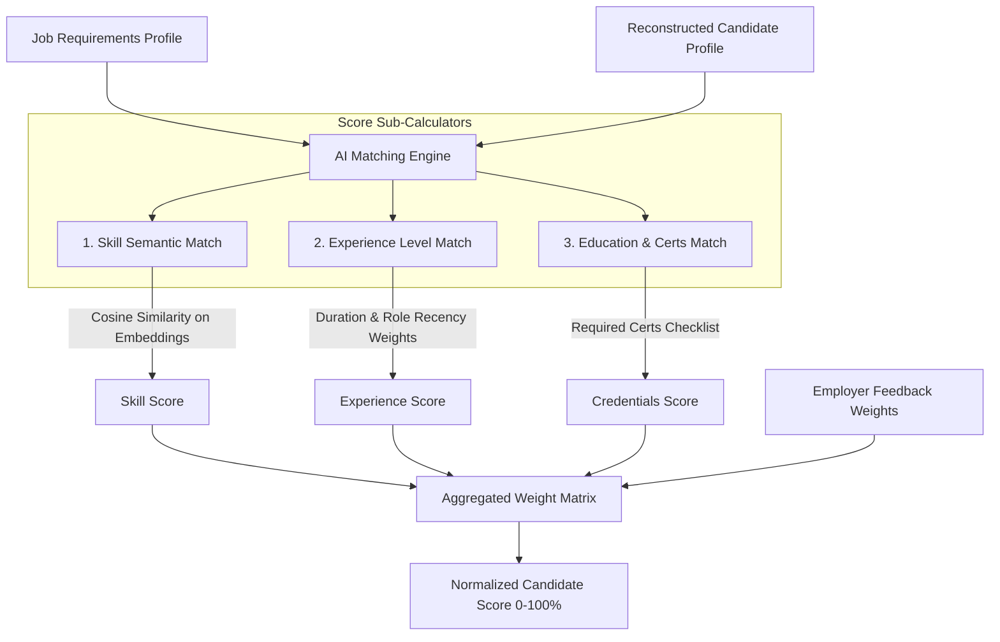
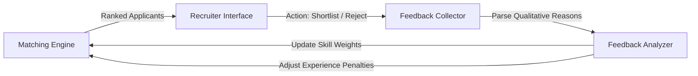

# 📐 FINDING_AI System Architecture Guide

This document describes the architectural layout, data pipelines, schema design, and algorithm workflows for the **FINDING_AI** recruitment platform.

---

## 🗺️ 1. High-Level System Architecture

FINDING_AI is structured with a decoupled frontend React SPA, a FastAPI REST backend, and locally hosted data-processing agents (Ollama + PostgreSQL pgvector).



---

## 🔄 2. Core Pipelines & Workflows

### A. Resume Upload & Parsing Pipeline
How raw resumes are uploaded, parsed by the local LLM, mapped to an archetype, and stored as an optimized delta structure:



---

### B. AI Candidate Matching Engine Pipeline
How the platform calculates matching scores between candidates and jobs:



---

### C. Feedback Loop Learning Cycle
How the matching parameters update dynamically based on hiring recruiter actions:



---

## 🗄️ 3. Database Schema Overview

We use PostgreSQL for transactional data and vector indexing:

### Table Relationships
```text
  +---------------+        1:1       +------------------+
  |    Users      |------------------|   UserProfiles   |
  |  (Auth Info)  |                  | (Personal Details)
  +---------------+                  +------------------+
          |                                   |
          | 1:N                               | 1:1
          v                                   v
  +---------------+                  +------------------+         1:N         +---------------------+
  |     Jobs      |                  |    Candidates    |---------------------|    ResumeDeltas     |
  | (Posting Reg) |                  | (Linked Profile) |                     | (Archetype Diff JSON|
  +---------------+                  +------------------+                     +---------------------+
          |                                   |                                          |
          | 1:N                               | 1:N                                      | N:1
          v                                   v                                          v
  +---------------+                  +------------------+                     +---------------------+
  | Applications  |<-----------------|  SkillEmbeddings |                     |  CareerArchetypes   |
  |  (Job Links)  |                  | (pgvector index) |                     | (Career Templates)  |
  +---------------+                  +------------------+                     +---------------------+
          |
          v
  +-----------------------+
  | EmployerFeedbackLogs  |
  | (Selection Metrics)   |
  +-----------------------+
```

---

## 📦 4. Detailed Component Specifications

### A. Resume Archetype & Delta Storage System (Module 4)
* **Problem**: Storing tens of thousands of complex resume profiles containing redundant text (e.g. standard skills like Git, HTML, Excel) causes database bloat.
* **Solution**:
  1. We establish a series of **Career Archetypes** (base templates for careers such as `React Developer`, `Project Manager`, etc.) containing standard skills, tools, and courses.
  2. When a candidate uploads a resume, the matching engine determines the closest career archetype.
  3. Instead of storing the full parsed profile, the database stores the Archetype ID and a **Resume Delta** (JSON structure recording unique certifications, additional skills, specific project achievements, and work duration).
  4. At query time, the candidate profile is reconstructed on-the-fly:
     $$\text{Profile} = \text{Archetype} \cup \text{Delta}$$

### B. Skill Graph & Semantic Representation (Module 5)
* **Ontology Structure**: Skills are linked in a Directed Acyclic Graph (DAG) with relationships:
  * `parent_of`: (e.g., `JavaScript` is a parent of `React`).
  * `related_to`: (e.g., `Docker` is related to `Kubernetes`).
* **Temporal Weight Decay**: The matching engine applies a time-decay function to candidate skills based on when they were last used:
  $$W_{\text{skill}} = W_{\text{base}} \times e^{-\lambda t}$$
  where:
  * $W_{\text{base}}$ is the initial skill score determined by LLM extraction context.
  * $\lambda$ is the decay constant (e.g., skill decays by 15% for each year it is unutilized).
  * $t$ is the elapsed years since the candidate held a job utilizing that skill.

### C. Feedback Learning System (Module 9)
* **Adjustment Loop**: If an employer rejects a candidate for "lacking Kubernetes experience" (qualitative text analyzed by Ollama), the system lowers the match weight of other related tools for that specific job listing, or increases the weight penalty for missing `Kubernetes`.
